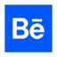

<h1 align="center">Hi 👋, I'm Furkan Yücel</h1>
<h3 align="center">A passionate UI Designer and Frontend Developer from Istanbul, Turkey</h3>

  

  

 🌱 I’m currently learning Html, Css, JS, Bootstrap, Jquery, Git
 

 👨‍💻 My official web site www.furkanyucel.com
 

 📫 How to reach me <a href="mailto:furkanyucelux@gmail.com">furkanyucelux@gmail.com</a>

<h3 align="center">Connect with me:</h3>

<!--  -->

<h3 align="center">Languages and Tools:</h3>

                

 

